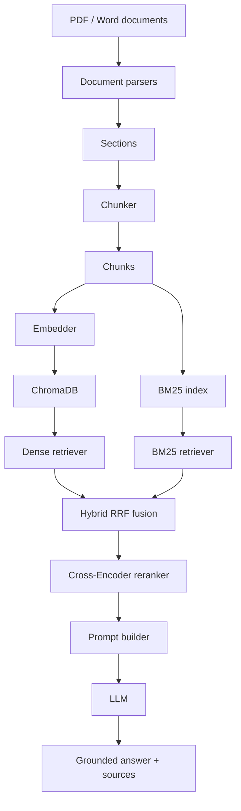
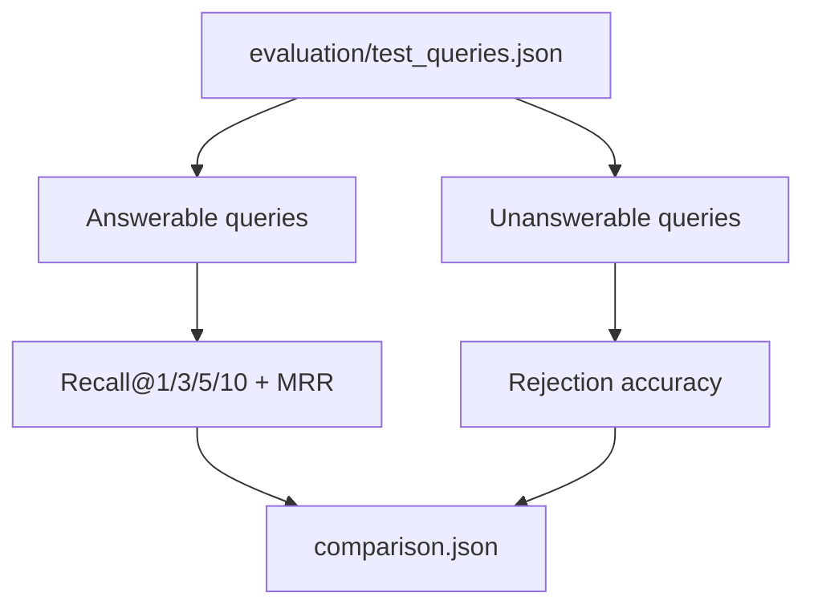

# doc-qa-agent

An end-to-end document question answering project for scientific and technical PDFs / Word documents. The pipeline parses source documents, splits them into chunks, builds dense and lexical retrieval indexes, reranks candidates, and generates grounded answers with source references.

## Background

This project was built to answer questions from two local documents:

- `data/raw/HuMengqing.pdf`
- `data/raw/Report.docx`

The goal is not just to produce answers, but to make the whole RAG pipeline measurable:

- parse documents into structured sections
- chunk sections into indexable units
- retrieve evidence with dense search and BM25
- fuse and rerank candidates
- generate grounded answers
- evaluate retrieval and no-answer behavior

## Architecture



Evaluation flow:



## Tech Stack

- Python 3.11+
- `pdfplumber` for PDF parsing
- `python-docx` for Word parsing
- `langchain-text-splitters` for chunking
- `sentence-transformers` with `BAAI/bge-large-en-v1.5`
- `chromadb` for persistent vector storage
- `rank_bm25` for lexical retrieval
- `Cross-Encoder/ms-marco-MiniLM-L-6-v2` for reranking
- OpenAI-compatible chat API via ScaDS.AI for generation

## Project Layout

```text
config/          YAML configuration
data/raw/        Source PDF and Word files
evaluation/      Annotated test queries and evaluation scripts
prompts/         Prompt templates
scripts/         Utility scripts for annotation
src/core/        Config and logging
src/document/    Parsing and chunking
src/retrieval/   Dense, BM25, hybrid, and reranking
src/generation/  Prompting, LLM wrapper, and RAG pipeline
main.py          CLI entry point
```

## Setup

Create a virtual environment and install the runtime dependencies:

```bash
python -m venv .venv
.venv/bin/pip install pdfplumber python-docx langchain-text-splitters sentence-transformers chromadb rank_bm25 openai python-dotenv pyyaml
```

Create a `.env` file with at least:

```bash
SCADS_API_KEY=your_scads_api_key
HF_TOKEN=your_hugging_face_token
```

`HF_TOKEN` is recommended for faster and more reliable model downloads.

## Run

Answer one question from the local documents:

```bash
.venv/bin/python main.py "What classification accuracy did the ResNet26-V2 model achieve?"
```

Annotate evaluation queries:

```bash
.venv/bin/python -m scripts.annotate_chunks
```

Run retrieval and rejection evaluation:

```bash
.venv/bin/python -m evaluation.evaluate
```

The evaluation command writes:

- `evaluation/results/v1_dense.json`
- `evaluation/results/v2a_hybrid.json`
- `evaluation/results/v2_hybrid_rerank.json`
- `evaluation/results/unanswerable_rejection.json`
- `evaluation/results/comparison.json`

## Evaluation Data

The current annotated test set contains 50 queries:

- 45 answerable queries
- 5 unanswerable queries

## V1 / V2 Comparison

Retrieval metrics are computed on the 45 answerable queries.

| Variant | Recall@1 | Recall@5 | Recall@10 | MRR |
|---|---:|---:|---:|---:|
| V1 dense only | 0.380 | 0.696 | 0.837 | 0.652 |
| V2a hybrid RRF | 0.309 | 0.730 | 0.874 | 0.624 |
| V2 hybrid + rerank | 0.420 | 0.750 | 0.874 | 0.715 |

No-answer evaluation on the 5 unanswerable queries:

| Metric | Value |
|---|---:|
| Rejection accuracy | 0.800 |

## Notes

- `data/chroma_db/` is created automatically when indexing runs.
- `evaluation/test_queries.json` only stores the final labels needed for evaluation.
- `evaluation/results/` contains reproducible metric snapshots for README and interview review.
