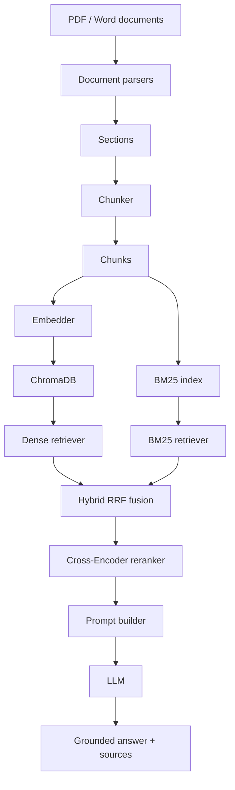
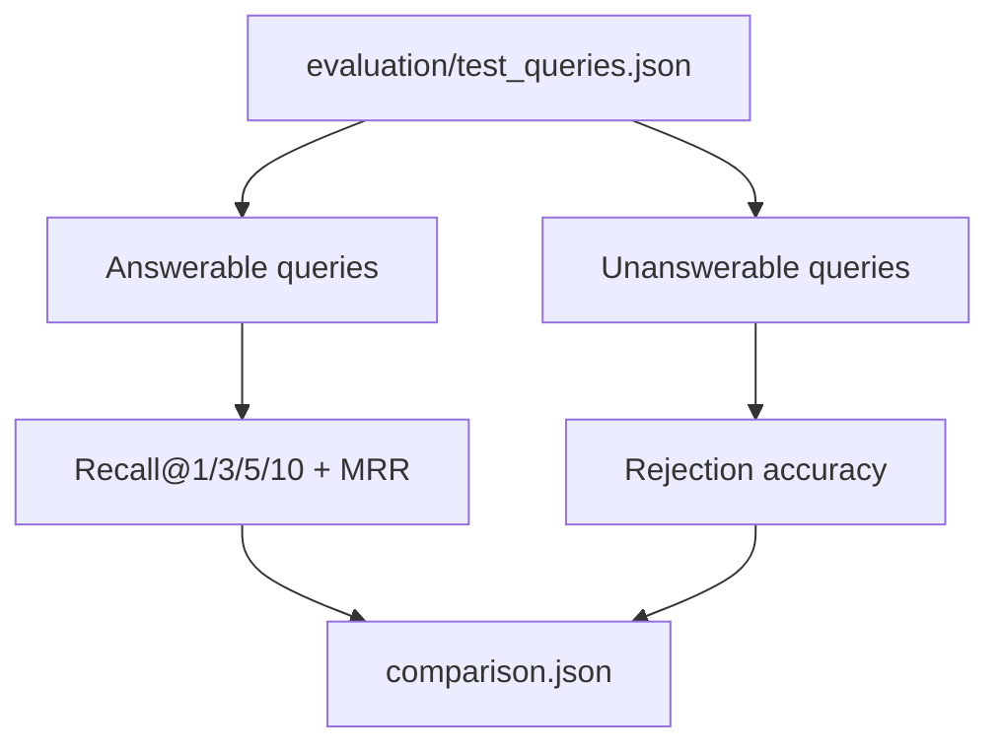

# doc-qa-agent

An end-to-end document question answering project for scientific and technical PDFs / Word documents. The pipeline parses source documents, splits them into chunks, builds dense and lexical retrieval indexes, reranks candidates, and generates grounded answers with source references.

## Background

This project was built to answer questions from two local documents:

- `data/raw/HuMengqing.pdf`
- `data/raw/Report.docx`

The goal is not just to produce answers, but to make the whole RAG pipeline measurable:

- parse documents into structured sections
- chunk sections into indexable units
- retrieve evidence with dense search and BM25
- fuse and rerank candidates
- generate grounded answers
- evaluate retrieval and no-answer behavior
- evaluate retrieved context and answer quality with RAGAS

## Architecture



Evaluation flow:



## Tech Stack

- Python 3.11+
- MinerU API for PDF parsing, table extraction, and formula-to-LaTeX conversion
- `python-docx` for Word parsing
- `langchain-text-splitters` for chunking
- `sentence-transformers` with `BAAI/bge-large-en-v1.5`
- `chromadb` for persistent vector storage
- `rank_bm25` for lexical retrieval
- ScaDS.AI-hosted `Qwen/Qwen3-Reranker-4B` for reranking
- OpenAI-compatible chat API via ScaDS.AI for generation

## Project Layout

```text
config/          YAML configuration
data/raw/        Source PDF and Word files
evaluation/      Annotated test queries and evaluation scripts
prompts/         Prompt templates
scripts/         Utility scripts for annotation
src/core/        Config and logging
src/document/    Parsing and chunking
src/retrieval/   Dense, BM25, hybrid, and reranking
src/generation/  Prompting, LLM wrapper, and RAG pipeline
main.py          CLI entry point
```

## Setup

Create a virtual environment and install the runtime dependencies:

```bash
python -m venv .venv
.venv/bin/pip install python-docx langchain-text-splitters sentence-transformers chromadb rank_bm25 openai python-dotenv pyyaml
```

Create a `.env` file with at least:

```bash
SCADS_API_KEY=your_scads_api_key
HF_TOKEN=your_hugging_face_token
MINERU_API_TOKEN=your_mineru_api_token
```

`HF_TOKEN` is recommended for faster and more reliable model downloads.

## PDF Parsing With MinerU

PDF ingestion uses the official MinerU cloud API. Set `MINERU_API_TOKEN` in
`.env`; the parser requests a pre-signed upload URL, uploads the PDF, submits
an asynchronous extraction task, polls for completion, and downloads the
resulting Markdown archive. The token is read at runtime and is never stored
in `config/config.yaml`.

MinerU receives the PDF content. Review its service terms and your project's
data-handling requirements before parsing sensitive documents. Configure the
cloud endpoint, model version, OCR option, and timeouts under
`document_parsing.mineru` in `config/config.yaml`.

MinerU output preserves formulas as LaTeX and tables as Markdown or HTML; the
parser converts it into the existing ordered text/table section format. There
is no `pdfplumber` fallback: a MinerU request failure stops PDF ingestion with
a clear error.

Word OMML equations are independently converted to inline LaTeX while parsing,
so expressions such as `x_i` and fractions remain searchable.

## Reranking Provider

The configured ScaDS.AI reranker posts all fused candidates to
`https://llm.scads.ai/v1/rerank` and expects a `results` list containing one
`index` and `relevance_score` for every supplied candidate. If ScaDS.AI uses a
different path for your account, update `reranking.endpoint` in
`config/config.yaml`.

The client waits at least `reranking.min_request_interval_seconds` between
requests and retries rate-limited (`429`) requests up to
`reranking.max_retries` times. It honors a numeric `Retry-After` response
header when ScaDS.AI provides one.

To return to the local MiniLM reranker, set `reranking.provider` to `local` and
set `reranking.model` to `cross-encoder/ms-marco-MiniLM-L-6-v2`.

## Run

Answer one question from the local documents:

```bash
.venv/bin/python main.py "What classification accuracy did the ResNet26-V2 model achieve?"
```

Annotate evaluation queries:

```bash
.venv/bin/python -m scripts.annotate_chunks
```

By default this reads `evaluation/test_queries_draft.json` and writes
`evaluation/test_queries.json`. Every draft file re-parses and re-chunks the
documents configured under `documents.paths` in `config/config.yaml`, so
whenever the parsing or chunking logic changes (chunk size, section
filtering, etc.), any previously annotated `relevant_chunk_ids` values refer
to stale chunk IDs and the affected query set must be re-annotated against
the new chunks. For a versioned query set (e.g. a fresh draft created after a
chunking change), pass explicit `--input`/`--output` paths under
`evaluation/test_queries/<version>/` instead of relying on the defaults:

```bash
.venv/bin/python -m scripts.annotate_chunks \
  --input evaluation/test_queries/v4/test_queries_draft.json \
  --output evaluation/test_queries/v4/test_queries.json \
  --rerank-candidates
```

This mode is interactive: for each query it prints the query, the reference
answer, and the top `--candidate-top-k` (default 10) hybrid-retrieved
candidates (add `--rerank-candidates` to rerank them with the Cross-Encoder
first), then prompts for the relevant chunk ID(s) or candidate rank number(s)
(comma-separated). Press Enter to keep any existing `relevant_chunk_ids`,
`s` to skip a query, or `q` to quit — progress is written to `--output` after
every query, so an interrupted run resumes where it left off (re-running the
same command skips nothing but lets you leave existing answers unless you
overwrite them).

For a query set too large to annotate one prompt at a time, export the full
candidate list per query to JSON instead, without any terminal prompts:

```bash
.venv/bin/python -m scripts.annotate_chunks \
  --input evaluation/test_queries/v4/test_queries_draft.json \
  --output evaluation/test_queries/v4/test_queries_candidates.json \
  --export-candidates --rerank-candidates
```

Each query record gains a `retrieval_candidates` field (chunk ID + full text
for every retrieved candidate). Open the file, read each query's candidates,
and fill in `relevant_chunk_ids` by hand (or with LLM assistance) using the
chunk IDs shown. Increase `--candidate-top-k` if you suspect the correct
chunk falls outside the default top 10.

After annotation, remove the candidate text before saving the final
evaluation set:

```bash
.venv/bin/python -m scripts.clean_retrieval_candidates \
  --input evaluation/test_queries/v4/test_queries_candidates.json \
  --output evaluation/test_queries/v4/test_queries.json
```

Use `--in-place` instead of `--output <path>` to overwrite the candidates
file directly once you're done reviewing it.

Run retrieval and rejection evaluation with the V2 labels:

```bash
.venv/bin/python -m evaluation.evaluate \
  --input evaluation/test_queries/v2/test_queries.json \
  --results-dir evaluation/results/v2
```

This command writes the following files to `evaluation/results/v2/`:

- `v1_dense.json`
- `v2a_hybrid.json`
- `v2_hybrid_rerank.json`
- `unanswerable_rejection.json`
- `comparison.json`

Run RAGAS evaluation for the same answerable queries:

```bash
.venv/bin/python -m evaluation.evaluate_ragas \
  --input evaluation/test_queries/v2/test_queries.json \
  --results-dir evaluation/results/v2
```

RAGAS uses an LLM as an evaluator through the configured OpenAI-compatible
ScaDS.AI endpoint. Start with a small sample when checking evaluator cost and
compatibility:

```bash
.venv/bin/python -m evaluation.evaluate_ragas \
  --input evaluation/test_queries/v2/test_queries.json \
  --results-dir evaluation/results/v2 \
  --limit 5
```

The RAGAS command writes `evaluation/results/v2/ragas_hybrid_rerank.json` with
per-query and aggregate Context Precision, Context Recall, Faithfulness, and
Factual Correctness scores. It evaluates only answerable queries; the existing
rejection evaluation remains responsible for unanswerable queries.

## Evaluation Data

The current annotated test set contains 50 queries:

- 45 answerable queries
- 5 unanswerable queries

## Evaluation Results

Both evaluations use 45 answerable queries. The 2,000-character baseline and
the 1,000-character configuration use labels generated for their respective
chunking schemes.

### 2,000 / 200 Chunk Baseline

Results are stored in `evaluation/results/v1/comparison.json`.

| Variant | Recall@1 | Hit@1 | Recall@5 | Hit@5 | Recall@10 | Hit@10 | MRR |
|---|---:|---:|---:|---:|---:|---:|---:|
| Dense only | 0.380 | 0.533 | 0.696 | 0.822 | 0.837 | 0.911 | 0.652 |
| Hybrid RRF | 0.309 | 0.467 | 0.730 | 0.822 | 0.874 | 0.956 | 0.624 |
| Hybrid RRF + rerank | 0.420 | 0.600 | 0.750 | 0.844 | 0.874 | 0.956 | 0.715 |

### 1,000 / 100 Chunk Configuration

Results are stored in `evaluation/results/v2/comparison.json`, using the labels
in `evaluation/test_queries/v2/test_queries.json`.

| Variant | Recall@1 | Hit@1 | Recall@5 | Hit@5 | Recall@10 | Hit@10 | MRR |
|---|---:|---:|---:|---:|---:|---:|---:|
| Dense only | 0.294 | 0.556 | 0.739 | 0.956 | 0.778 | 0.956 | 0.704 |
| Hybrid RRF | 0.302 | 0.578 | 0.741 | 0.933 | 0.869 | 0.956 | 0.728 |
| Hybrid RRF + rerank | 0.335 | 0.667 | 0.759 | 0.933 | 0.869 | 0.956 | 0.768 |

Within this experiment, hybrid retrieval plus Cross-Encoder reranking is the
best configuration. Compared with the previous 2,000-character chunk baseline,
it improves Hit@1
from 0.600 to 0.667, Hit@5 from 0.844 to 0.933, and MRR from 0.715 to 0.768.
Hit@10 remains 0.956. Recall values should be interpreted with care because the
two chunk configurations use different relevant-chunk labels and granularity.

### Expanded Candidate-Pool Experiment

Results are stored in `evaluation/results/v3/comparison.json`, using the same
V2 labels. This experiment increases Dense and BM25 retrieval from 20 to 40
candidates, keeps 30 RRF-fused candidates, and reranks those 30 candidates
before calculating the final Top-1/3/5/10 metrics.

| Variant | Recall@1 | Hit@1 | Recall@5 | Hit@5 | Recall@10 | Hit@10 | MRR |
|---|---:|---:|---:|---:|---:|---:|---:|
| Dense only | 0.294 | 0.556 | 0.746 | 0.956 | 0.785 | 0.956 | 0.704 |
| Hybrid RRF | 0.313 | 0.600 | 0.741 | 0.933 | 0.835 | 0.956 | 0.736 |
| Hybrid RRF + rerank | 0.335 | 0.667 | 0.726 | 0.911 | 0.857 | 0.956 | 0.767 |

The larger candidate pool does not improve the reranked result over V2: Hit@1
is unchanged at 0.667, MRR changes from 0.768 to 0.767, and both Recall@5 and
Hit@5 decline. The experiment preserves Hit@10 at 0.956, so the added pool
does not recover the two queries that lack relevant evidence in Top-10.

This is a combined retrieval-depth and reranking-pool experiment, rather than
an isolated reranking-pool ablation. The deeper Dense and BM25 candidate lists
also change the fused RRF ordering. The decline suggests that the additional
lower-ranked candidates introduce distractors that the current Cross-Encoder
does not consistently place below the labeled evidence. Future comparisons
should use a dedicated, fixed Chroma collection to minimize approximate-index
tie variation between runs.

### Qwen3 Reranker Ablation

Results are stored in
`evaluation/results/ablation/qwen3_pool_10/comparison.json`. This is a
controlled reranker comparison against
`evaluation/results/ablation/rerank_pool_10/comparison.json`: both runs use
the same V2 labels, 40 Dense candidates, 40 BM25 candidates, and 10 RRF-fused
candidates. Their Dense-only and Hybrid RRF metrics are identical, so the
differences below isolate the reranker.

| Reranker | Recall@1 | Hit@1 | Recall@3 | Hit@3 | Recall@5 | Hit@5 | Recall@10 | Hit@10 | MRR |
|---|---:|---:|---:|---:|---:|---:|---:|---:|---:|
| MiniLM-L-6-v2 | 0.346 | 0.689 | 0.615 | 0.889 | 0.752 | 0.956 | 0.835 | 0.956 | 0.782 |
| Qwen3-Reranker-4B | 0.389 | 0.733 | 0.657 | 0.911 | 0.783 | 0.933 | 0.835 | 0.956 | 0.824 |

Qwen3-Reranker-4B is the strongest configuration for early ranking: it
improves Hit@1 by 0.044 and MRR by 0.042, while Recall@1, Recall@3, and
Recall@5 also increase. Candidate recall is unchanged at Top-10 because the
same 10 RRF candidates are reranked. Qwen3 does not strictly dominate MiniLM:
Hit@5 declines from 0.956 to 0.933 because one query's first relevant chunk is
moved below rank five. Use Qwen3 when first-result quality is the priority, and
retain this Top-5 regression as a target for a larger follow-up evaluation.

No-answer evaluation on the five unanswerable queries remains unchanged:

| Metric | Value |
|---|---:|
| Rejection accuracy | 0.800 |

## Notes

- `data/chroma_db/` is created automatically when indexing runs.
- Versioned evaluation labels are stored under `evaluation/test_queries/`.
- `evaluation/results/` contains reproducible metric snapshots for README and interview review.
