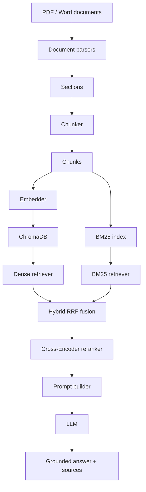
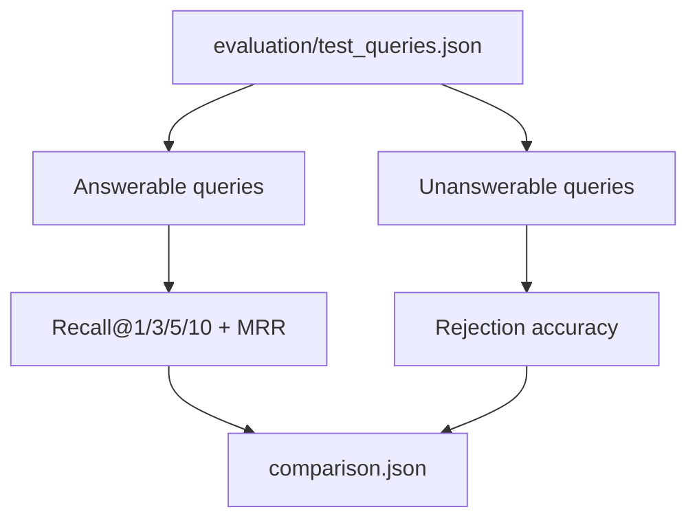

# doc-qa-agent

An end-to-end document question answering project for scientific and technical PDFs / Word documents. The pipeline parses source documents, splits them into chunks, builds dense and lexical retrieval indexes, reranks candidates, and generates grounded answers with source references.

## Background

This project was built to answer questions from two local documents:

- `data/raw/HuMengqing.pdf`
- `data/raw/Report.docx`

The goal is not just to produce answers, but to make the whole RAG pipeline measurable:

- parse documents into structured sections
- chunk sections into indexable units
- retrieve evidence with dense search and BM25
- fuse and rerank candidates
- generate grounded answers
- evaluate retrieval and no-answer behavior
- evaluate retrieved context and answer quality with RAGAS

## Architecture



Evaluation flow:



## Tech Stack

- Python 3.11+
- `pdfplumber` for PDF parsing
- `python-docx` for Word parsing
- `langchain-text-splitters` for chunking
- `sentence-transformers` with `BAAI/bge-large-en-v1.5`
- `chromadb` for persistent vector storage
- `rank_bm25` for lexical retrieval
- `Cross-Encoder/ms-marco-MiniLM-L-6-v2` for reranking
- OpenAI-compatible chat API via ScaDS.AI for generation

## Project Layout

```text
config/          YAML configuration
data/raw/        Source PDF and Word files
evaluation/      Annotated test queries and evaluation scripts
prompts/         Prompt templates
scripts/         Utility scripts for annotation
src/core/        Config and logging
src/document/    Parsing and chunking
src/retrieval/   Dense, BM25, hybrid, and reranking
src/generation/  Prompting, LLM wrapper, and RAG pipeline
main.py          CLI entry point
```

## Setup

Create a virtual environment and install the runtime dependencies:

```bash
python -m venv .venv
.venv/bin/pip install pdfplumber python-docx langchain-text-splitters sentence-transformers chromadb rank_bm25 openai python-dotenv pyyaml
```

Create a `.env` file with at least:

```bash
SCADS_API_KEY=your_scads_api_key
HF_TOKEN=your_hugging_face_token
```

`HF_TOKEN` is recommended for faster and more reliable model downloads.

## Run

Answer one question from the local documents:

```bash
.venv/bin/python main.py "What classification accuracy did the ResNet26-V2 model achieve?"
```

Annotate evaluation queries:

```bash
.venv/bin/python -m scripts.annotate_chunks
```

Export candidate IDs and full text for later manual JSON annotation without terminal prompts:

```bash
.venv/bin/python -m scripts.annotate_chunks --export-candidates --rerank-candidates
```

This writes `evaluation/test_queries_candidates.json`. Add selected candidate IDs
to each query's `relevant_chunk_ids`, then use that file as `--input` for the
evaluation commands.

After annotation, remove the candidate text before saving the final evaluation
set in place:

```bash
.venv/bin/python -m scripts.clean_retrieval_candidates \
  --input evaluation/test_queries_candidates.json \
  --in-place
```

Run retrieval and rejection evaluation with the V2 labels:

```bash
.venv/bin/python -m evaluation.evaluate \
  --input evaluation/test_queries/v2/test_queries.json \
  --results-dir evaluation/results/v2
```

This command writes the following files to `evaluation/results/v2/`:

- `v1_dense.json`
- `v2a_hybrid.json`
- `v2_hybrid_rerank.json`
- `unanswerable_rejection.json`
- `comparison.json`

Run RAGAS evaluation for the same answerable queries:

```bash
.venv/bin/python -m evaluation.evaluate_ragas \
  --input evaluation/test_queries/v2/test_queries.json \
  --results-dir evaluation/results/v2
```

RAGAS uses an LLM as an evaluator through the configured OpenAI-compatible
ScaDS.AI endpoint. Start with a small sample when checking evaluator cost and
compatibility:

```bash
.venv/bin/python -m evaluation.evaluate_ragas \
  --input evaluation/test_queries/v2/test_queries.json \
  --results-dir evaluation/results/v2 \
  --limit 5
```

The RAGAS command writes `evaluation/results/v2/ragas_hybrid_rerank.json` with
per-query and aggregate Context Precision, Context Recall, Faithfulness, and
Factual Correctness scores. It evaluates only answerable queries; the existing
rejection evaluation remains responsible for unanswerable queries.

## Evaluation Data

The current annotated test set contains 50 queries:

- 45 answerable queries
- 5 unanswerable queries

## Evaluation Results

Both evaluations use 45 answerable queries. The 2,000-character baseline and
the 1,000-character configuration use labels generated for their respective
chunking schemes.

### 2,000 / 200 Chunk Baseline

Results are stored in `evaluation/results/v1/comparison.json`.

| Variant | Recall@1 | Hit@1 | Recall@5 | Hit@5 | Recall@10 | Hit@10 | MRR |
|---|---:|---:|---:|---:|---:|---:|---:|
| Dense only | 0.380 | 0.533 | 0.696 | 0.822 | 0.837 | 0.911 | 0.652 |
| Hybrid RRF | 0.309 | 0.467 | 0.730 | 0.822 | 0.874 | 0.956 | 0.624 |
| Hybrid RRF + rerank | 0.420 | 0.600 | 0.750 | 0.844 | 0.874 | 0.956 | 0.715 |

### 1,000 / 100 Chunk Configuration

Results are stored in `evaluation/results/v2/comparison.json`, using the labels
in `evaluation/test_queries/v2/test_queries.json`.

| Variant | Recall@1 | Hit@1 | Recall@5 | Hit@5 | Recall@10 | Hit@10 | MRR |
|---|---:|---:|---:|---:|---:|---:|---:|
| Dense only | 0.294 | 0.556 | 0.739 | 0.956 | 0.778 | 0.956 | 0.704 |
| Hybrid RRF | 0.302 | 0.578 | 0.741 | 0.933 | 0.869 | 0.956 | 0.728 |
| Hybrid RRF + rerank | 0.335 | 0.667 | 0.759 | 0.933 | 0.869 | 0.956 | 0.768 |

Hybrid retrieval plus Cross-Encoder reranking is the best current configuration.
Compared with the previous 2,000-character chunk baseline, it improves Hit@1
from 0.600 to 0.667, Hit@5 from 0.844 to 0.933, and MRR from 0.715 to 0.768.
Hit@10 remains 0.956. Recall values should be interpreted with care because the
two chunk configurations use different relevant-chunk labels and granularity.

### Expanded Candidate-Pool Experiment

Results are stored in `evaluation/results/v3/comparison.json`, using the same
V2 labels. This experiment increases Dense and BM25 retrieval from 20 to 40
candidates, keeps 30 RRF-fused candidates, and reranks those 30 candidates
before calculating the final Top-1/3/5/10 metrics.

| Variant | Recall@1 | Hit@1 | Recall@5 | Hit@5 | Recall@10 | Hit@10 | MRR |
|---|---:|---:|---:|---:|---:|---:|---:|
| Dense only | 0.294 | 0.556 | 0.746 | 0.956 | 0.785 | 0.956 | 0.704 |
| Hybrid RRF | 0.313 | 0.600 | 0.741 | 0.933 | 0.835 | 0.956 | 0.736 |
| Hybrid RRF + rerank | 0.335 | 0.667 | 0.726 | 0.911 | 0.857 | 0.956 | 0.767 |

The larger candidate pool does not improve the reranked result over V2: Hit@1
is unchanged at 0.667, MRR changes from 0.768 to 0.767, and both Recall@5 and
Hit@5 decline. The experiment preserves Hit@10 at 0.956, so the added pool
does not recover the two queries that lack relevant evidence in Top-10.

This is a combined retrieval-depth and reranking-pool experiment, rather than
an isolated reranking-pool ablation. The deeper Dense and BM25 candidate lists
also change the fused RRF ordering. The decline suggests that the additional
lower-ranked candidates introduce distractors that the current Cross-Encoder
does not consistently place below the labeled evidence. Future comparisons
should use a dedicated, fixed Chroma collection to minimize approximate-index
tie variation between runs.

No-answer evaluation on the five unanswerable queries remains unchanged:

| Metric | Value |
|---|---:|
| Rejection accuracy | 0.800 |

## Notes

- `data/chroma_db/` is created automatically when indexing runs.
- Versioned evaluation labels are stored under `evaluation/test_queries/`.
- `evaluation/results/` contains reproducible metric snapshots for README and interview review.
